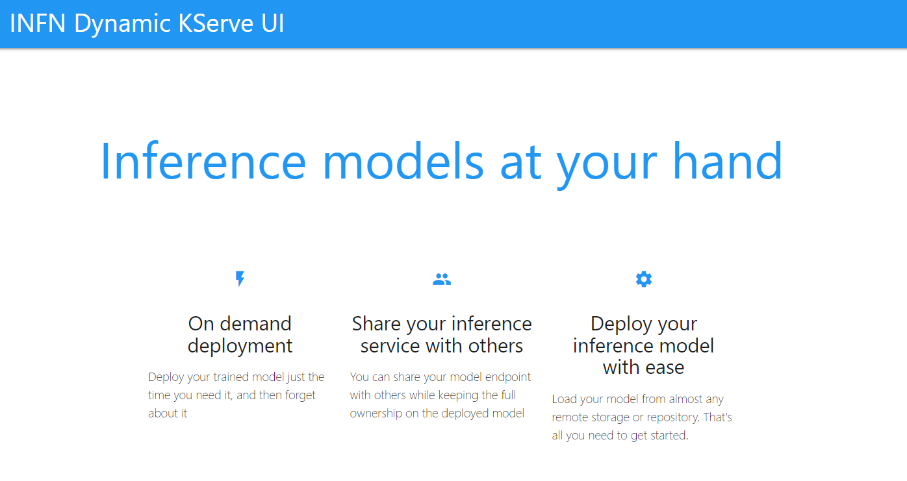

## Run locally

- Uncomment the load k8s config file option in `main.js`
- Access to the k8s cluster with Kserve installed is needed
- `node main.js`

## Dev environment with skaffold

```bash
curl -Lo skaffold https://storage.googleapis.com/skaffold/releases/latest/skaffold-linux-amd64 && \
sudo install skaffold /usr/local/bin/
```